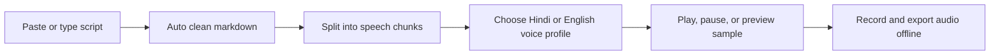

# AetherVocal Studio

Premium browser-based Hindi and English text-to-speech studio built with React and Vite.

<p align="center">
  
  
  
</p>

## Overview

AetherVocal Studio is a polished voice synthesis workspace that turns long-form text into natural speech using the browser's built-in speech engine. It is designed to feel like a premium creator tool, with a studio-style interface, curated voice profiles, live audio visualization, markdown cleaning, chunked playback, and offline audio export.

The project is intentionally positioned as a demo-ready product that can be explained clearly in interviews: it solves script-to-audio generation, handles long text in chunks, supports Hindi and English voice selection, and exports audio directly from the browser without requiring a backend service.

## Key Features

- Hindi and English text-to-speech support.
- 12+ curated male and female voice profiles.
- Sample voice preview before selecting a profile.
- Speed and pitch controls for natural voice tuning.
- Auto-cleaning for markdown symbols like `#`, `*`, and `_`.
- Editor and preview modes for script preparation.
- Chunk queue for long-form narration playback.
- Real-time audio spectrum visualizer.
- Play, pause, resume, stop, and per-chunk playback controls.
- Offline audio export in MP3, WAV, and OGG formats.
- Re-download of the last generated audio file.
- Dark and light theme toggle.

## Why This Project Feels Premium

- Strong visual hierarchy with a studio-style layout.
- Clear product language instead of a generic demo UI.
- Practical usability features like sample text chips, markdown sanitization, and long-text chunking.
- A focused workflow that mirrors a real creator tool rather than a toy example.

## Tech Stack

- React 18
- Vite
- Lucide React icons
- Browser Speech Synthesis API
- Web Audio / capture utilities for export workflow

## How It Works



## Setup

```bash
npm install
npm run dev
```

To create a production build:

```bash
npm run build
```

To preview the production build locally:

```bash
npm run preview
```

## Project Structure

```text
src/
  App.jsx                 Main studio workflow and playback state
  components/             UI sections for editor, voices, player, and visualizer
  utils/                  Text cleaning, chunking, export, and voice matching helpers
```

## Interview Talking Points

- Built a full client-side audio studio without relying on a backend for the core speech workflow.
- Solves long-form narration by splitting text into manageable speech chunks.
- Improves speech quality by cleaning markdown artifacts before synthesis.
- Adds voice matching logic to map curated profiles to available system voices.
- Balances utility and presentation with a polished, product-level UI.

## Future Improvements

- Persist user presets for voices, speed, and pitch.
- Add waveform history and export progress states.
- Expand voice matching rules for more browsers and locales.
- Add project persistence with local storage for saved scripts.

## License

No license has been declared yet. Add one if you plan to publish or collaborate publicly.